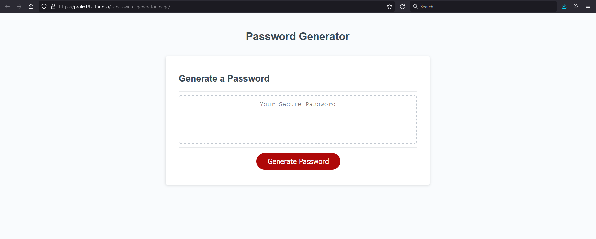

# JavaScript Password Generator Page

## Description

Web-based utility that uses JavaScript to generate a random password based on critera selected by a user.

### Website Link:

[https://prolix19.github.io/js-password-generator-page/](https://prolix19.github.io/js-password-generator-page/)

### The Story:

This generator was created to meet the requirements of the following user story:

```
AS AN employee with access to sensitive data
I WANT to randomly generate a password that meets certain criteria
SO THAT I can create a strong password that provides greater security
```

### Screenshot of Finished Utility:



### For Further Details:

Please check the repository's commit history and associated comments to see more information about this web-based password generator utility.